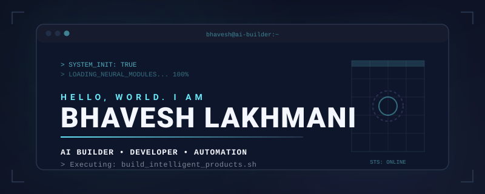

  

  

  

  
### `>_ ABOUT`
 

<table width="100%">
  <tr>
    <td width="100%">
       
      I'm <b>Bhavesh Lakhmani</b> — a BTech CSE (AI/ML) student building <code>AI systems</code>, automation workflows and full-stack products.
        
      I learn by building, experimenting and shipping real projects.
        
      <code>FOCUS</code>
       
      AI · AUTOMATION · AGENTS · RAG · VOICE AI
        
    </td>
  </tr>
</table>

  

### `>_ CURRENTLY BUILDING`
 

<table width="100%">
  <tr>
    <td width="50%">
       
      <b>AI AUTOMATION</b> 
      Designing workflows that let software handle real-world tasks autonomously.  
      <code>STATUS // ACTIVE</code>
        
    </td>
    <td width="50%">
       
      <b>VOICE AI</b> 
      Creating conversational, low-latency interfaces.  
      <code>STATUS // ACTIVE</code>
        
    </td>
  </tr>
  <tr>
    <td width="50%">
       
      <b>RAG SYSTEMS</b> 
      Building context-aware, data-driven LLM applications.  
      <code>STATUS // ACTIVE</code>
        
    </td>
    <td width="50%">
       
      <b>FULL-STACK AI</b> 
      Integrating models into scalable web architectures.  
      <code>STATUS // ACTIVE</code>
        
    </td>
  </tr>
</table>

  

### `>_ SELECTED BUILDS`
 

<table width="100%">
  <tr>
    <td width="50%">
       
      <b><a href="#">Study Mirror AI</a></b> 
      AI-powered student productivity and study platform.  
      <code>STACK:</code> Next.js · TypeScript · LLM APIs 
      <code>STATUS // DEPLOYED</code>
        
    </td>
    <td width="50%">
       
      <b><a href="#">DentalPlan AI</a></b> 
      AI treatment-planning copilot concept for dentists.  
      <code>STACK:</code> Python · RAG · React 
      <code>STATUS // PROTOTYPE</code>
        
    </td>
  </tr>
  <tr>
    <td width="50%">
       
      <b><a href="#">AI Voice Agent</a></b> 
      Conversational voice agent interface for hands-free automation.  
      <code>STACK:</code> Voice AI · Node.js · WebSockets 
      <code>STATUS // IN DEVELOPMENT</code>
        
    </td>
    <td width="50%">
       
      <b><a href="#">Bharat Beyond</a></b> 
      AI-powered tourism intelligence and destination balancing.  
      <code>STACK:</code> Supabase · Next.js · Tailwind 
      <code>STATUS // SIH PROJECT</code>
        
    </td>
  </tr>
</table>

  

### `>_ STACK`
 

<table width="100%">
  <tr>
    <td width="25%"><b>LANGUAGES</b></td>
    <td width="75%"><code>Python</code> · <code>TypeScript</code> · <code>JavaScript</code></td>
  </tr>
  <tr>
    <td width="25%"><b>FRONTEND</b></td>
    <td width="75%"><code>React</code> · <code>Next.js</code> · <code>Tailwind</code></td>
  </tr>
  <tr>
    <td width="25%"><b>BACKEND</b></td>
    <td width="75%"><code>Node.js</code> · <code>Supabase</code> · <code>Firebase</code> · <code>PostgreSQL</code></td>
  </tr>
  <tr>
    <td width="25%"><b>AI / ML</b></td>
    <td width="75%"><code>LLM APIs</code> · <code>RAG</code> · <code>Agents</code> · <code>Voice AI</code> · <code>Automation</code></td>
  </tr>
</table>

  

  

  
### `>_ GITHUB ACTIVITY`
 

<table width="100%">
  <tr>
    <td align="center">
       
      <picture>
        <source media="(prefers-color-scheme: dark)" srcset="https://raw.githubusercontent.com/bhaveshlakhmani25-ui/bhaveshlakhmani25-ui/output/github-snake-dark.svg" />
        <source media="(prefers-color-scheme: light)" srcset="https://raw.githubusercontent.com/bhaveshlakhmani25-ui/bhaveshlakhmani25-ui/output/github-snake-dark.svg" />
        
      </picture>
        
    </td>
  </tr>
</table>

  

### `>_ OPERATIONS`
 

<table width="100%">
  <tr>
    <td width="15%"><code>2026</code></td>
    <td width="85%"><b>SMART INDIA HACKATHON</b> Bharat Beyond</td>
  </tr>
  <tr>
    <td width="15%"><code>2026</code></td>
    <td width="85%"><b>NEURON CLUB</b> Outreach & Community</td>
  </tr>
</table>

  

### `>_ CONNECT`
 

<table width="100%">
  <tr>
    <td>
      <a href="https://www.linkedin.com/in/bhavesh-lakhmani-40099835a">LINKEDIN // ESTABLISH CONNECTION</a>
    </td>
  </tr>
</table>

  

  <small><code>SYSTEM.STATUS = "ALWAYS BUILDING. ALWAYS LEARNING."</code></small>

