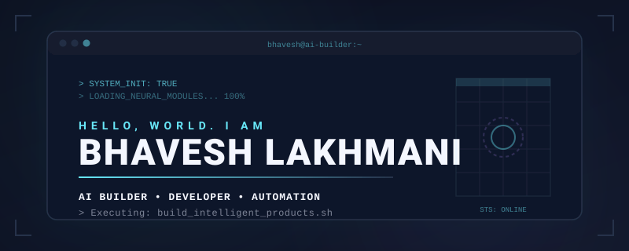

  

  

  

  
### `>_ ABOUT ME`
 

<table width="100%">
  <tr>
    <td width="100%">
       
      I'm <b>Bhavesh Lakhmani</b>, a B.Tech CSE (AI/ML) student focused on building AI products and continuously learning new programming languages and technologies.  
      My interests span AI, automation, agents, RAG, and voice AI, with a focus on turning ideas into practical software.  
      I believe in a simple philosophy: <b>BUILD → BREAK → LEARN → IMPROVE → SHIP</b>
        
    </td>
  </tr>
</table>

  

### `>_ CURRENTLY BUILDING`
 

<table width="100%">
  <tr>
    <td width="50%">
       
      🤖 <b>AI AUTOMATION</b> 
      Building intelligent workflows connecting AI models, tools and real-world actions.  
       <code>STATUS // ACTIVE</code>
        
    </td>
    <td width="50%">
       
      🎙️ <b>VOICE AI</b> 
      Exploring conversational voice systems, speech interfaces and AI assistants.  
       <code>STATUS // EXPLORING</code>
        
    </td>
  </tr>
  <tr>
    <td width="50%">
       
      🧠 <b>RAG & AI AGENTS</b> 
      Learning how retrieval, context, tools and agents work together.  
       <code>STATUS // LEARNING</code>
        
    </td>
    <td width="50%">
       
      ⚡ <b>FULL-STACK AI</b> 
      Building complete applications where AI is part of the product.  
       <code>STATUS // BUILDING</code>
        
    </td>
  </tr>
</table>

  

### `>_ TECH STACK`
 

<table width="100%">
  <tr>
    <td width="30%"><b>LANGUAGES</b></td>
    <td width="70%"><code>Python</code> · <code>TypeScript</code> · <code>JavaScript</code> · <code>Java</code> · <code>C</code></td>
  </tr>
  <tr>
    <td width="30%"><b>FRONTEND</b></td>
    <td width="70%"><code>React</code> · <code>Next.js</code> · <code>Tailwind CSS</code></td>
  </tr>
  <tr>
    <td width="30%"><b>BACKEND / DATABASE</b></td>
    <td width="70%"><code>Node.js</code> · <code>Supabase</code> · <code>Firebase</code> · <code>PostgreSQL</code></td>
  </tr>
  <tr>
    <td width="30%"><b>AI</b></td>
    <td width="70%"><code>Generative AI</code> · <code>LLMs</code> · <code>RAG</code> · <code>AI Agents</code> · <code>Voice AI</code> · <code>AI Automation</code></td>
  </tr>
  <tr>
    <td width="30%"><b>TOOLS</b></td>
    <td width="70%"><code>Git</code> · <code>GitHub</code> · <code>Antigravity</code> · <code>Replit</code> · <code>Lovable</code> · <code>Google AI Studio</code></td>
  </tr>
</table>

  

### `>_ SELECTED BUILDS`
 

<table width="100%">
  <tr>
    <td width="50%">
       
      <code>PROJECT // TRAFFIC PULSE AI</code> 
      ──────────────────────────── 
      AI-powered traffic intelligence concept focused on understanding traffic conditions and improving urban mobility.  
      <b>STACK:</b> AI · Traffic Intelligence · Computer Vision  
       <code>STATUS // ACTIVE</code>
        
    </td>
    <td width="50%">
       
      <code>PROJECT // DENTALPLAN AI</code> 
      ──────────────────────────── 
      AI treatment-planning copilot concept designed to help dentists organize clinical information and assist with treatment planning.  
      <b>STACK:</b> AI · RAG · React · Supabase  
       <code>STATUS // PROTOTYPE</code>
        
    </td>
  </tr>
  <tr>
    <td width="50%">
       
      <code>PROJECT // BHARAT BEYOND</code> 
      ──────────────────────────── 
      AI-powered tourism intelligence platform designed to improve destination discovery while helping balance tourist distribution.  
      <b>STACK:</b> AI · Tourism · Next.js · Supabase  
       <code>STATUS // SIH PROJECT</code>
        
    </td>
    <td width="50%">
       
      <code>PROJECT // CHANGE REHEARSAL</code> 
      ──────────────────────────── 
      AI-assisted developer workflow system exploring safer ways to understand, test and rehearse code changes before they reach production.  
      <b>STACK:</b> AI · Developer Tools · React · IBM Bob  
       <code>STATUS // HACKATHON</code>
        
    </td>
  </tr>
</table>

  

### `>_ CURRENTLY LEARNING`
 

<table width="100%">
  <tr>
    <td width="50%">
      <b>AI SYSTEMS</b> 
       
      • Generative AI 
      • RAG Systems 
      • AI Agents 
      • Voice AI 
      • LLM Integration 
    </td>
    <td width="50%">
      <b>DEVELOPMENT</b> 
       
      • Full-Stack Development 
      • Backend Architecture 
      • APIs & Integrations 
      • Database Design 
      • AI-assisted Development 
    </td>
  </tr>
</table>

  

### `>_ EXPERIENCE & COMMUNITY`
 

<table width="100%">
  <tr>
    <td width="20%"><code>CURRENT</code></td>
    <td width="80%">
      <b>NEURON CLUB</b> 
      Technical Lead · Outreach & Marketing  
      Contributing to technical initiatives, developer community activities, events, hackathons, outreach and marketing.
    </td>
  </tr>
</table>

  

### `>_ HACKATHONS`
 

<table width="100%">
  <tr>
    <td width="50%">
       
      <b>Smart India Hackathon</b> 
      <code>PARTICIPANT</code>
        
    </td>
    <td width="50%">
       
      <b>IBM Bob Hackathon</b> 
      <code>PARTICIPANT</code>
        
    </td>
  </tr>
  <tr>
    <td width="50%">
       
      <b>Vivekananda Innovation Hackathon</b> 
      <code>PARTICIPANT</code>
        
    </td>
    <td width="50%">
       
      <b>Hack Divengers 2.0</b> 
      <code>PARTICIPANT</code>
        
    </td>
  </tr>
</table>

  

  

  
### `>_ GITHUB ACTIVITY`
 

  
  
   
  

  

### `>_ CONTRIBUTION TELEMETRY`
 

<table width="100%">
  <tr>
    <td align="center">
       
      <picture>
        <source media="(prefers-color-scheme: dark)" srcset="https://raw.githubusercontent.com/bhaveshlakhmani25-ui/bhaveshlakhmani25-ui/output/github-snake-dark.svg" />
        <source media="(prefers-color-scheme: light)" srcset="https://raw.githubusercontent.com/bhaveshlakhmani25-ui/bhaveshlakhmani25-ui/output/github-snake-dark.svg" />
        
      </picture>
        
    </td>
  </tr>
</table>

  

  

  
### `>_ CONNECT`
 

<table width="100%">
  <tr>
    <td align="center">
      
      &nbsp;&nbsp;
      
      &nbsp;&nbsp;
      
    </td>
  </tr>
</table>

  

  <small><code>SYSTEM.STATUS = "ALWAYS BUILDING. ALWAYS LEARNING."</code></small>

